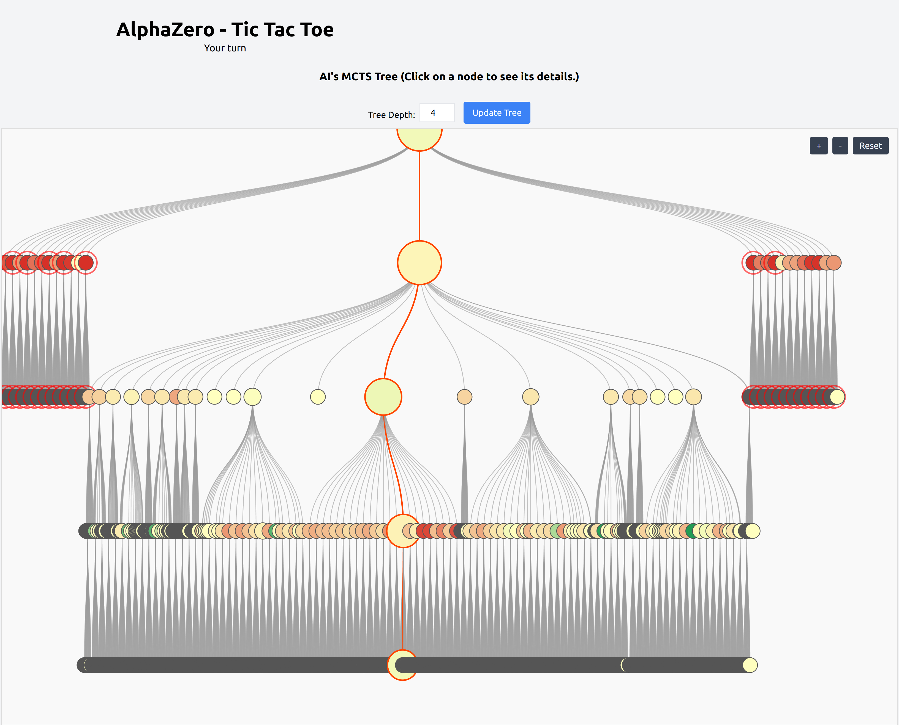

AlphaZero Tic-Tac-Toe with Monte Carlo Tree Search (6x6)
===========================


A web-based 6x6 Tic-Tac-Toe game powered by an AI leveraging an AlphaZero algorithm with Monte Carlo Tree Search (MCTS). Users can choose to play first or second and compete against the AI in an interactive and user-friendly environment. In order to win, the player has to complete 4 'X's or 'O's in series instead of the traditional three in a series for a 3 x 3 game.

Table of Contents
-----------------

- [AlphaZero Tic-Tac-Toe with Monte Carlo Tree Search (6x6)](#alphazero-tic-tac-toe-with-monte-carlo-tree-search-6x6)
  - [Table of Contents](#table-of-contents)
  - [Features](#features)
  - [Technologies Used](#technologies-used)
    - [Backend](#backend)
    - [Frontend](#frontend)
  - [Project Structure](#project-structure)
  - [Installation](#installation)
    - [Prerequisites](#prerequisites)
    - [Clone the Repository](#clone-the-repository)
    - [Setup Backend](#setup-backend)
    - [Setup Frontend](#setup-frontend)
    - [Playing the Game](#playing-the-game)
  - [API Documentation](#api-documentation)
    - [Available Endpoints](#available-endpoints)
  - [Future Ideas](#future-ideas)
  - [Contributing](#contributing)
    - [Guidelines](#guidelines)
  - [License](#license)
  - [Contact](#contact)
  - [Acknowledgments](#acknowledgments)

Features
--------

-   **Interactive 6x6 Tic-Tac-Toe Board:** Engage with a responsive and clickable game board.
-   **AI Opponent:** Compete against an AI that uses Monte Carlo Tree Search (MCTS) with a trained policy model.
-   **Player Order Selection:** Choose to play first (Player X) or second (Player O).
-   **MCTS Tree Visualization:** Visual representation of the AI's decision-making process, including node information and probability of winning.
-   **AI Probability Chart:** Radial bar chart displaying the AI's probability of winning based on the current game state.
-   **Multiple Concurrent Games:** Supports multiple users playing simultaneously without interference.
-   **Responsive Design:** Ensures a seamless experience across various devices and screen sizes.

Technologies Used
-----------------

### Backend

-   **FastAPI:** Web framework for building APIs.
-   **[Python](https://www.python.org/):** Programming language.
-   **[PyTorch](https://pytorch.org/):** Machine learning library for the AI.
-   **[Uvicorn](https://www.uvicorn.org/):** ASGI server for running FastAPI.
-   **Pydantic:** Data validation and settings management using Python type annotations.

### Frontend

-   **[React](https://reactjs.org/):** JavaScript library for building user interfaces.
-   **[Axios](https://axios-http.com/):** Promise-based HTTP client for making API requests.
-   **[Recharts](https://recharts.org/):** Charting library for React.
-   **React Spinners:** Loading spinners for React.
-   **[VisX](https://airbnb.io/visx/):** For the Tree diagram
-   **[Tailwind CSS](https://tailwindcss.com/):** Utility-first CSS framework.

Project Structure
-----------------
```scss
AlphaZero-Tic-Tac-Toe-App/
├── backend/
│   ├── 6-6-4-pie.policy
│   ├── ConnectN.py
│   ├── __init__.py
│   ├── main.py
│   ├── MCTS.py
│   ├── original_codes_and_notebooks/
│   │   ├── alphazero-TicTacToe-advanced.ipynb
│   │   ├── alphazero-TicTacToe-advanced-play-only.ipynb
│   │   ├── alphazero-TicTacToe.ipynb
│   │   ├── ConnectN.py
│   │   ├── main.py
│   │   ├── MCTS.py
│   │   └── PlayNew.py
│   ├── policy.py
│   └── requirements.txt
├── frontend/
│   ├── src/
│   │   ├── App.js
│   │   ├── components/
│   │   │   ├── GameBoard.js
│   │   │   ├── MctsTree.js
│   │   │   └── ... (other frontend components)
│   ├── public/
│   │   └── index.html
│   ├── package.json
│   └── ... (other frontend files)
└── README.md
└── LICENSE
```

-   **backend/**: Contains all FastAPI backend code and related files.
-   **frontend/**: Contains all React frontend code and related files.
-   **README.md**: Project documentation.
-   **LICENSE**: MIT License

Installation
------------

### Prerequisites

-   **Python 3.7+**: Install from [python.org](https://www.python.org/downloads/).
-   **Node.js and npm**: Install from [nodejs.org](https://nodejs.org/).
-   **Git**: Install from [git-scm.com](https://git-scm.com/downloads).

### Clone the Repository

`git clone https://github.com/sagarnildass/AlphaZero-Tic-Tac-Toe-App
cd AlphaZero-Tic-Tac-Toe-App`

### Setup Backend

1.  **Navigate to the backend directory:**

    `cd backend`

2.  **Create a virtual environment:**

    `python -m venv venv`

3.  **Activate the virtual environment:**

    -   **Windows:**

        `venv\Scripts\activate`

    -   **macOS/Linux:**

        `source venv/bin/activate`

4.  **Install dependencies:**

    `pip install -r requirements.txt`

5.  **Ensure the policy model file is in place:**

    The `6-6-4-pie.policy` file should be located in the `backend/` directory. If it's not present, ensure you have trained the model or obtained it from a reliable source.

6.  **Run the backend server:**

    `uvicorn main:app --host 0.0.0.0 --port 8000 --reload`

    The backend server will start at `http://0.0.0.0:8000`.

### Setup Frontend

1.  **Open a new terminal window/tab.**

2.  **Navigate to the frontend directory:**

    `cd frontend`

3.  **Install dependencies:**

    `npm install`

4.  **Start the frontend development server:**

    `npm start`

    The frontend will start at `http://localhost:3000`.

### Playing the Game

1.  **Start a New Game:**
    -   Upon opening the application, you'll be presented with options to **"Go First"** or **"Go Second"**.
    -   Click on your desired option to start the game.


1.  **Making a Move:**

    -   If you chose to go first, the message will indicate **"Your turn"**.
    -   Click on an empty cell in the 6x6 grid to make your move.
    -   After your move, the AI will make its move automatically.
2.  **AI's Turn:**

    -   A loading spinner will appear while the AI is thinking.
    -   Once the AI makes its move, the board updates, and the message changes to **"Your turn"**.
3.  **Winning the Game:**

    -   The game continues until a player wins or the game ends in a draw.
    -   Upon conclusion, a message will display the winner, and you can choose to **"Start New Game"**.
4.  **AI Probability Chart:**

    -   Displays the AI's probability of winning based on the current game state.
    -   Updated after each AI move.
    -   The Player can also click any node to get its information.
    -   The MCTS summary is also shown at the end of each move.


5.  **MCTS Tree Visualization:**

    -   Shows the AI's decision-making process through a visual MCTS tree.
    -   You can adjust the **Tree Depth** to view more or fewer levels of the tree.
    -   You can also click the zoom-in / zoom-out button to enlarge a specific part of the image.



API Documentation
-----------------

FastAPI automatically generates interactive API documentation. Access it by navigating to `http://0.0.0.0:8000/docs` in your browser when the backend server is running.

### Available Endpoints

1. **POST `/start_game`**

- **Description:** Initialize a new game.
- **Request Body:**

```json
{
  "player": 1  // 1 for first (Player X), -1 for second (Player O)
}
```
- **Response:**

```json
{
  "status": "Game started",
  "board": [[0, 0, ...], [...], ...],
  "player": 1
}
```

2. **POST `/make_move`**

- **Description:** Make a move on the board.
- **Request Body:**

```json
{
  "row": 2,
  "col": 3
}
```
- **Response:**

```json
{
  "status": "success",
  "board": [[0, 0, ...], [...], ...],
  "player": -1,
  "winner": null
}
```

3. **GET `/get_board`**

- **Description:** Retrieve the current game board.

- **Response:**

```json
{
  "board": [[0, 0, ...], [...], ...],
  "player": -1,
  "winner": null
}
```

4. **GET `/ai_move`**

- **Description:** AI makes a move.

- **Response:**

```json
{
  "status": "success",
  "move": [2, 3],
  "board": [[0, 0, ...], [...], ...],
  "player": 1,
  "winner": null
}
```

4. **GET `/ai_probability`**

- **Description:** Get the AI's probability of winning.

- **Response:**

```json
{
  "status": "In progress",
  "probability_of_winning": 0.75
}
```

5. **GET `/get_mcts_tree`**

- **Description:** Retrieve the MCTS tree data.
- **Query Parameters:**
    -   `max_depth` (optional): Maximum depth of the tree to retrieve. Default is `3`.
- **Response:**

```json
{
  "tree": {
    "id": 123456789,
    "N": 10,
    "V": 1.0,
    "U": 0,
    "prob": 0.5,
    "is_best_path": true,
    "children": [
      {
        "id": 987654321,
        "N": 5,
        "V": 0.8,
        "U": 0.3,
        "prob": 0.6,
        "is_best_path": true,
        "children": null,
        "action": [2, 3]
      },
      ...
    ]
  }
}
```

6. **GET `/get_mcts_subtree`**

- **Description:** Retrieve a subtree of the MCTS tree starting from a specific node.
- **Query Parameters:**
    -   `node_id`: ID of the node to start the subtree from.
    -   `max_depth` (optional): Maximum depth of the subtree to retrieve. Default is `2`.
- **Response:**

```json
{
  "tree": {
    "id": 987654321,
    "N": 5,
    "V": 0.8,
    "U": 0.3,
    "prob": 0.6,
    "is_best_path": true,
    "children": null,
    "action": [2, 3]
  },
  "error": null
}
```

7. **GET `/get_mcts_summary`**

- **Description:** Get a summary of the MCTS tree.

- **Response:**

```json
{
  "summary": {
    "total_nodes": 15,
    "average_N": 4.0,
    "average_V": 0.6
  }
}
```

Future Ideas
------------

1.  **Implement a Database for Multi-Tenant Support:**

    -   **Description:** Support multiple concurrent users more efficiently using a database.
    -   **Benefits:**
        -   Enhanced scalability and performance.
        -   Improved data integrity and security.
        -   Simplified data querying and management.
2.  **User Authentication and Profiles:**

    -   **Description:** Introduce user registration and authentication mechanisms (e.g., email/password, OAuth).
    -   **Benefits:**
        -   Personalized user experiences.
        -   Ability to track user statistics and game history.
        -   Enhanced security and user data protection.
3.  **Persistent Game History:**

    -   **Description:** Store game histories, allowing users to review past games and analyze AI decisions.
    -   **Benefits:**
        -   Enhanced learning and improvement for users.
        -   Ability to revisit and share memorable games.
4.  **Real-Time Multiplayer Mode:**

    -   **Description:** Allow users to play against each other in real-time over the internet.
    -   **Benefits:**
        -   Increased engagement and competitiveness.
        -   Expanded user base through social interactions.
5.  **Enhanced AI Features:**

    -   **Description:** Improve the AI's capabilities by integrating more advanced models or optimizing the MCTS algorithm.
    -   **Benefits:**
        -   More challenging and intelligent AI opponents.
        -   Reduced computation time for faster AI moves.
6.  **Responsive and Accessible Design Improvements:**

    -   **Description:** Enhance the frontend for better responsiveness and accessibility (e.g., keyboard navigation, screen reader support).
    -   **Benefits:**
        -   Broader user reach, including users with disabilities.
        -   Improved overall user experience across devices.
7.  **Leaderboard and Achievements:**

    -   **Description:** Implement leaderboards to showcase top players and achievements to reward user milestones.
    -   **Benefits:**
        -   Increased user motivation and retention.
        -   Enhanced community engagement.
8.  **Customization Options:**

    -   **Description:** Allow users to customize the game board, pieces, and themes.
    -   **Benefits:**
        -   Personalized user experiences.
        -   Increased visual appeal and user satisfaction.
9.  **Performance Optimization:**

    -   **Description:** Optimize both backend and frontend code for better performance and reduced latency.
    -   **Benefits:**
        -   Smoother and faster user interactions.
        -   Enhanced scalability for a growing user base.
10. **Comprehensive Testing and CI/CD Integration:**

    -   **Description:** Implement automated testing and Continuous Integration/Continuous Deployment pipelines.
    -   **Benefits:**
        -   Improved code reliability and quality.
        -   Streamlined deployment processes.

Contributing
------------

Contributions are welcome! Please follow these steps:

1.  **Fork the Repository.**

2.  **Create a New Branch:**

    `git checkout -b feature/your-super-awesome-feature-name`

3.  **Commit Your Changes:**

    `git commit -m "Add some super-awesome-feature"`

4.  **Push to the Branch:**

    `git push origin feature/your-super-awesome-feature-name`

5.  **Open a Pull Request.**

### Guidelines

-   Ensure that your code follows the project's coding standards.
-   Provide clear and concise commit messages.
-   Test your changes thoroughly before submitting.
-   Update the documentation if necessary.

License
-------

This project is licensed under the MIT License. See the LICENSE file for details.

Contact
-------

For any inquiries or feedback, please contact sagarnildass@gmail.com.

Acknowledgments
---------------

-   Inspired by DeepMind's AlphaZero's approach.
-   Thanks to the open-source communities of FastAPI, React, Recharts, and Tailwind CSS.

**Note:** This README assumes that the policy model (`6-6-4-pie.policy`) and other necessary backend files (`ConnectN.py`, `MCTS.py`, `policy.py`) are properly configured and located within the `backend/` directory. Ensure that all dependencies are correctly installed, and paths are appropriately set in the backend code.

If you encounter any issues during setup or usage, please refer to the [Issues](https://github.com/yourusername/alphazero-tictactoe/issues) section of the GitHub repository or contact the project maintainer.